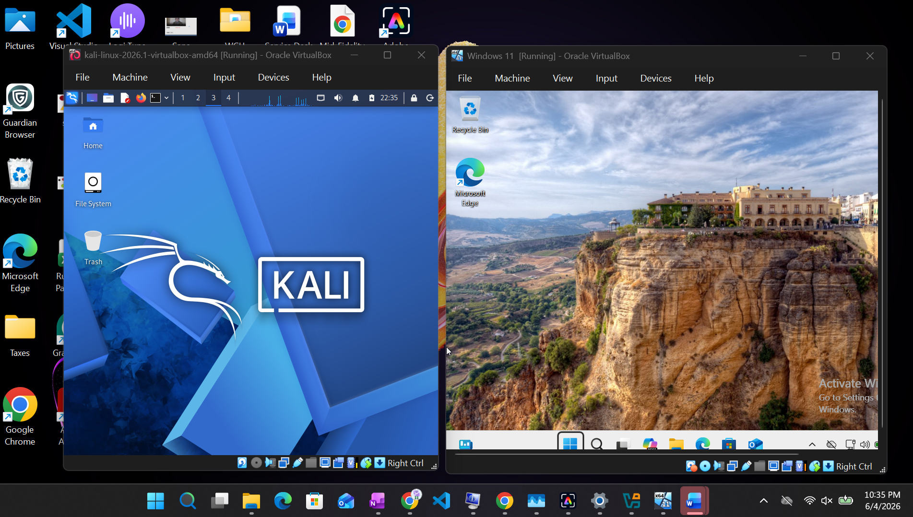
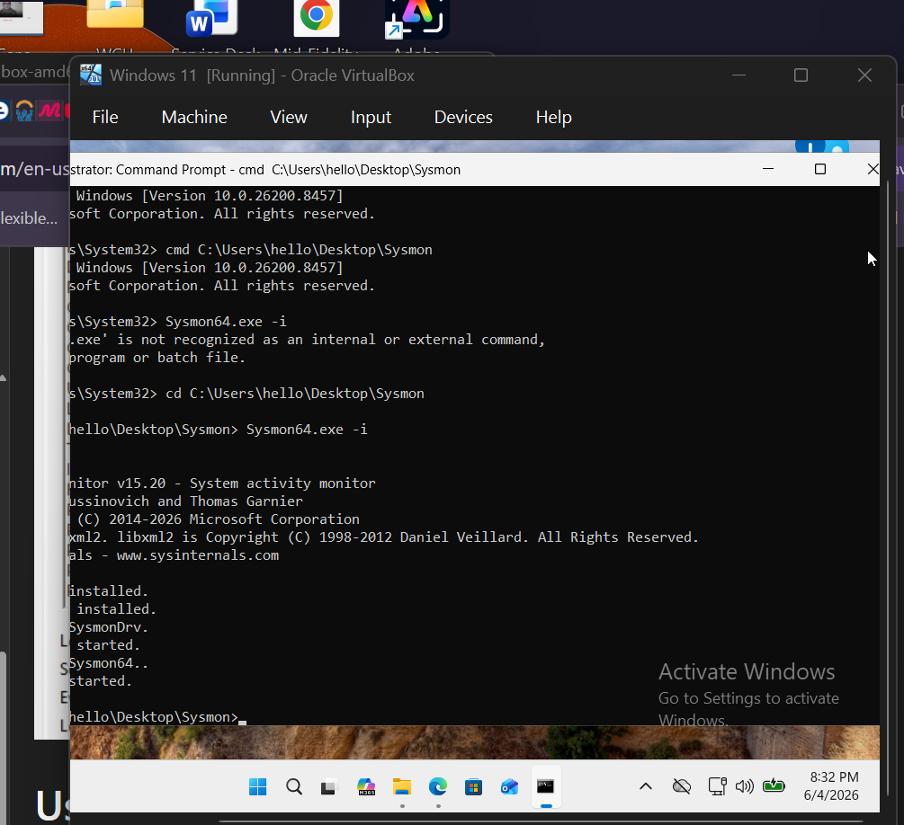
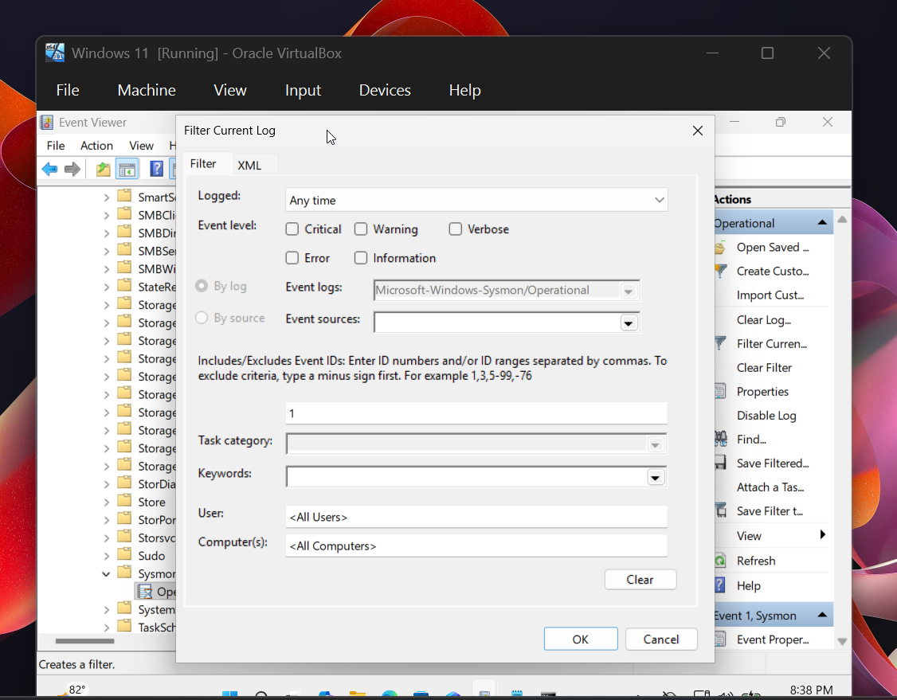
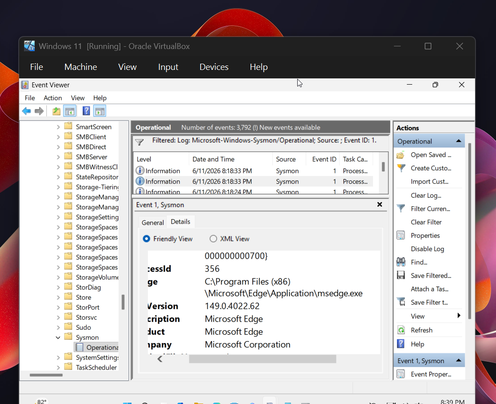
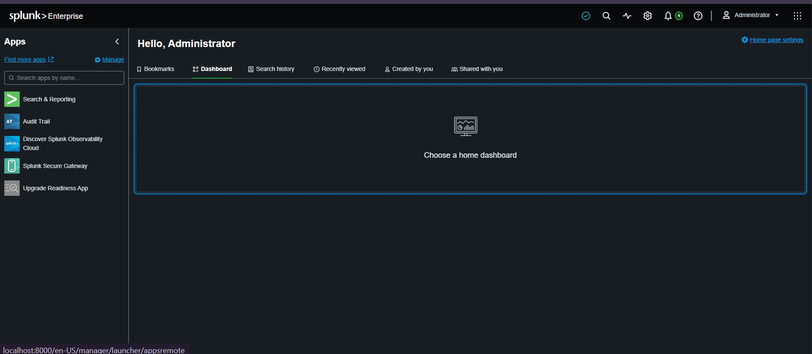
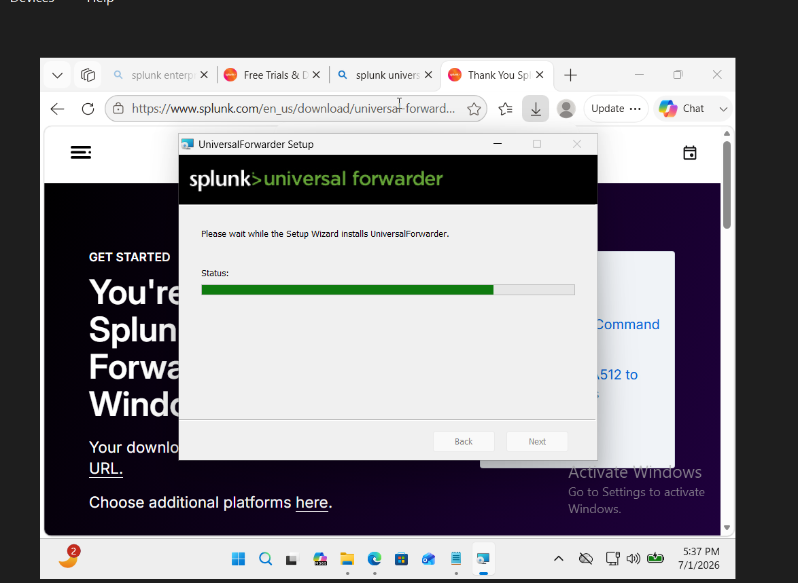
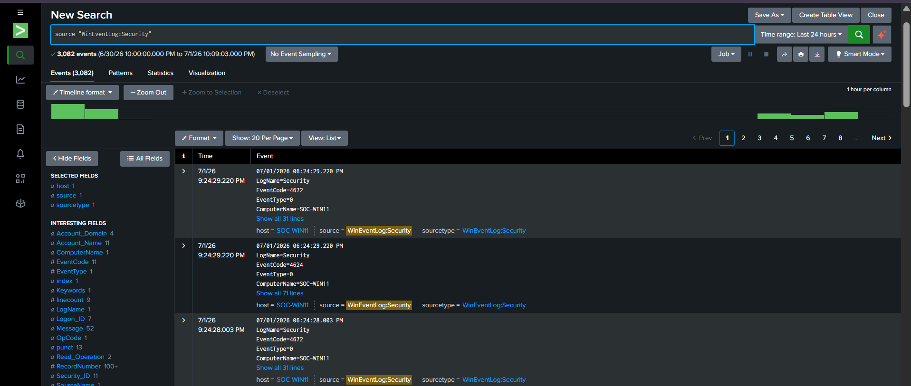

# SOC-Lab

Building a SOC home lab using Windows 11, Kali Linux, Sysmon, and Splunk to develop hands-on experience in security monitoring, threat detection, log analysis, and SOC analyst workflows.

## Overview

This project documents the creation of a Security Operations Center (SOC) home lab built in VirtualBox. The lab is designed to simulate real-world security monitoring activities and provide practical experience with endpoint telemetry, event analysis, SIEM technologies, and incident investigation.

## Technologies Used

- Windows 11
- Kali Linux
- Oracle VirtualBox
- Microsoft Sysmon
- Splunk (Coming Soon)

## Goals

- Learn SIEM fundamentals
- Analyze Windows event logs
- Monitor endpoint activity with Sysmon
- Detect suspicious behavior
- Practice SOC analyst workflows
- Develop threat detection skills
- Build a cybersecurity portfolio project

## Lab Architecture

Kali Linux VM (Attacker)
        │
        ▼

        
Windows 11 VM (Target)
├── Sysmon
├── Windows Event Logs
└── Event Viewer Analysis
        │
        ▼
        
Splunk (Coming Soon)

## Lab Components

- Windows 11 VM
- Kali Linux VM
- Sysmon
- Windows Event Logs
- Splunk (Planned)

## Project Status

### Phase 1 – Environment Setup ✅

- Installed Oracle VirtualBox
- Created Windows 11 VM
- Imported Kali Linux VM
- Configured virtual environment

### Phase 2 – Endpoint Monitoring ✅

- Installed Microsoft Sysmon
- Verified Sysmon service operation
- Analyzed Process Creation events (Event ID 1)
- Investigated parent-child process relationships
- Generated test activity using Microsoft Edge, Windows Explorer, and Command Prompt

### Phase 3 – SIEM Integration 🚧

- Splunk installation
- Windows Event Log ingestion
- Sysmon log ingestion
- Dashboard creation

## Planned Detection Use Cases

- Failed Login Detection (Event ID 4625)
- Successful Login Monitoring (Event ID 4624)
- Process Creation Monitoring (Sysmon Event ID 1)
- Network Connection Monitoring (Sysmon Event ID 3)
- PowerShell Activity Monitoring
- Basic Threat Hunting


- Windows 11 VM and Kali Linux VM running in VirtualBox.

### Virtual Machines


### Windows and Kali Setup



### Sysmon Installation

*Sysmon successfully installed and operational.*



### Event ID 1 Analysis

*Process creation monitoring using Sysmon Event ID 1.*



### Microsoft Edge Process Creation

Sysmon Event ID 1 capturing the execution of Microsoft Edge (msedge.exe) and associated process metadata.


### Splunk Enterprise Installation and Configuration 

## Objective

Install and configure Splunk Enterprise on the host machine to serve as the Security Information and Event Management (SIEM) platform for collecting, indexing, and analyzing security logs from the Windows 11 virtual machine.

## Completed

* Downloaded Splunk Enterprise 10.4.0 for Windows.
* Installed Splunk Enterprise on the Windows host machine.
* Created the Splunk administrator account during installation.
* Successfully launched the Splunk web interface.
* Verified access to the Splunk Enterprise dashboard using a web browser.
* Confirmed the SIEM platform is operational and ready to receive log data.

## Skills Practiced

* SIEM deployment
* Splunk Enterprise installation
* Initial Splunk configuration
* Web interface administration
* Security monitoring infrastructure setup

## Key Learning

Splunk Enterprise serves as the central platform for collecting, indexing, searching, and analyzing security data. Rather than storing logs on individual systems, endpoint devices can forward their logs to Splunk, allowing security analysts to investigate events from a centralized location.

## Outcome

Successfully deployed Splunk Enterprise on the host machine, establishing the core SIEM infrastructure for the SOC lab. The environment is now prepared for integrating the Windows 11 virtual machine using the Splunk Universal Forwarder and ingesting Sysmon and Windows Event Logs for security monitoring.





# 📸 Screenshot 1 — Splunk Enterprise Installation

**What this shows**

This screenshot captures the successful installation of **Splunk Enterprise** on my Windows host machine. Splunk Enterprise serves as the central Security Information and Event Management (SIEM) platform for my home SOC lab.

**What I learned**

* Installed Splunk Enterprise as the primary SIEM.
* Configured the web interface (port 8000).
* Created an administrator account.
* Verified that the Splunk management console was operational.


# 📸 Screenshot 2 — Installing Splunk Universal Forwarder



## Installing the Splunk Universal Forwarder

This screenshot documents the installation of the **Splunk Universal Forwarder** on my Windows 11 virtual machine (SOC-WIN11).

The Universal Forwarder is a lightweight agent that securely collects Windows Event Logs and forwards them to the Splunk Enterprise server.

**Configuration**

* Installed Universal Forwarder
* Configured the receiving server
* Configured forwarding to Splunk Enterprise
* Restarted the service
* Verified connectivity


> "Rather than reading logs locally, enterprise environments install lightweight agents called forwarders on endpoints. These agents continuously collect logs and securely send them to the SIEM for centralized monitoring. This closely mirrors how Splunk deployments work in production environments."


# 📸 Screenshot 3 — Windows Security Logs Successfully Received



## Windows Security Event Logs Successfully Ingested

**What this shows**

This screenshot confirms that my Windows 11 endpoint (**SOC-WIN11**) is successfully forwarding Windows Security Event Logs into Splunk Enterprise.

I verified log ingestion by querying:

```spl
source="WinEventLog:Security"
```

The search returned more than **3,000 security events**, confirming successful communication between the endpoint and the SIEM.

Events observed include:

* Event ID **4624** – Successful Logon
* Event ID **4672** – Special Privileges Assigned to New Logon
* Windows Security Log events
* Host: **SOC-WIN11**

**Skills Demonstrated**

* SIEM configuration
* Windows Event Log collection
* Log forwarding
* SPL searches
* Endpoint monitoring
* Security log analysis
* Troubleshooting data ingestion

> "This was the point where I verified my lab was functioning correctly. The Windows endpoint was continuously forwarding security logs into Splunk Enterprise. I used SPL searches to validate the incoming data and confirmed authentication-related events were being collected successfully. This established the foundation for future detection engineering, dashboard creation, and threat hunting exercises."

---

# 🚀 What's Next

The next phase of this lab will build on this foundation by adding:

* Install Sysmon for enhanced endpoint telemetry
* Configure Sysmon log collection in Splunk
* Simulate attacks from Kali Linux
* Detect failed logins (Event ID 4625)
* Build SOC dashboards
* Write SPL detection queries
* Perform incident investigations

---


## Project Status

🚧 In Progress
